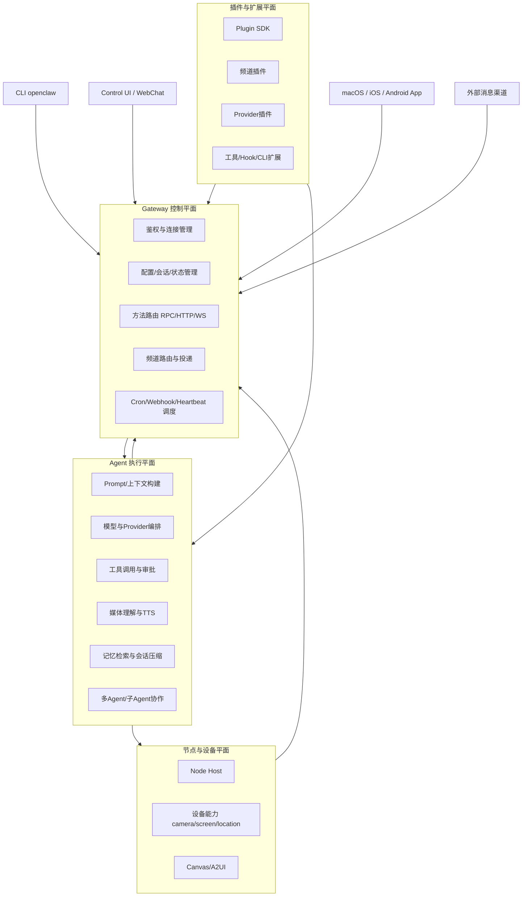
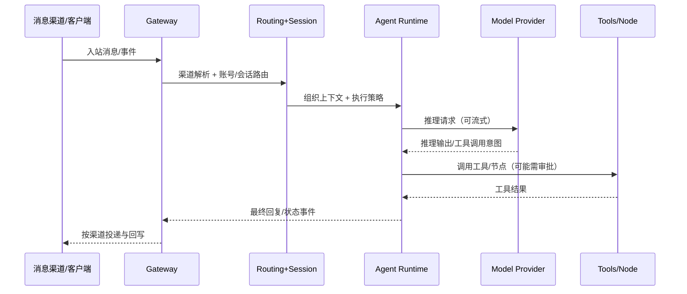

# OpenClaw 功能分析（功能视角）

## 1. 项目定位

OpenClaw 是一个“多渠道 AI 助手控制平面 + 执行平面”系统。  
从功能上看，它不是单一聊天机器人，而是把以下能力组合成一个统一平台：

- 多消息渠道接入（收发、路由、权限）
- Agent 运行时（模型推理、工具调用、会话管理）
- 网关控制平面（RPC/HTTP/WS、配置、状态、调度）
- 设备节点能力（手机/桌面端 camera、screen、location、canvas 等）
- 插件与技能生态（频道扩展、Provider 扩展、工具扩展）

---

## 2. 功能分析图（整体分层）

---

## 3. 核心业务闭环图（消息到回复）

---

## 4. 功能域完整分析

### 4.1 接入与初始化功能域

- 向导与初始化：`setup`、`onboard`、`configure`
- 配置管理：`config get/set/unset/validate`
- 健康诊断：`doctor`、`status`、`health`
- 升级与维护：`update`、`reset`、`uninstall`

本域目标：把“首次可用”和“持续可运维”流程标准化。

### 4.2 Gateway 控制平面功能域

- 统一方法面：健康、配置、会话、skills、agents、cron、node、device、chat、send、agent
- 协议面：WebSocket 主通道 + HTTP API（含 OpenAI/OpenResponses 兼容入口）
- 控制面事件：presence、heartbeat、cron、node pair、exec approval 等
- Web 面：Control UI、Dashboard、WebChat

本域目标：统一调度和状态管理，屏蔽不同终端/渠道差异。

### 4.3 Agent 运行与推理功能域

- Prompt 与上下文组装
- 模型选择、降级与故障切换
- 工具调用链与结果回注
- 子 Agent/多 Agent 协同
- 回复流式化、分块发送、重试与投递策略

本域目标：让“消息处理”变成稳定、可策略化的执行管线。

### 4.4 模型与 Provider 功能域

- 模型发现与配置：`models list/scan/set`
- 多 Provider 支持与兼容层
- OAuth/API Key 双路径鉴权
- Provider 插件化（可扩展新模型源）

本域目标：把模型能力抽象为可替换后端，不与渠道或端强绑定。

### 4.5 渠道接入与消息路由功能域

- 核心渠道基座：Telegram、WhatsApp、Discord、Slack、Signal、Google Chat、IRC、iMessage（及别名规范化）
- 渠道插件扩展：Matrix、Teams、LINE、Mattermost、Nostr、Twitch、Zalo 等
- 渠道共性能力：账号管理、探活 probe、目标解析、分块发送、线程/群组规则
- 安全控制：pairing、allowlist、DM policy、mention gating、命令鉴权

本域目标：任意入口统一接入同一 Agent 能力。

### 4.6 工具、节点与设备能力功能域

- 工具面：exec、browser、apply_patch、diff、web 等
- 节点面：`node.pair.*`、`node.invoke`、`device.token.*`
- 设备能力：camera、screen recording、location、notifications、canvas
- 审批与隔离：exec approvals + sandbox policy

本域目标：把“AI 回复”升级为“可执行动作”。

### 4.7 自动化与调度功能域

- 定时任务：`cron add/list/run/runs`
- Webhook 自动触发
- Hook 生命周期扩展（before/after agent/tool 等）
- 心跳与 presence 机制

本域目标：从“被动响应消息”升级为“主动自动化系统”。

### 4.8 会话与记忆功能域

- Session 生命周期：list/preview/patch/reset/delete/compact
- 记忆检索与重建索引：`memory` 命令 + embedding/search 管线
- 长短期上下文管理：会话裁剪、压缩、去重、衰减策略

本域目标：保证长期可用的上下文连续性和检索效率。

### 4.9 插件与技能生态功能域

- Plugin SDK：支持注册 tool/channel/provider/gateway method/cli/service/hook
- 技能管理：`skills list/info/check` + 安装更新
- 生态扩展包：频道插件、记忆插件、provider auth 插件、工作流插件

本域目标：让 OpenClaw 从“产品”变成“平台”。

### 4.10 安全与治理功能域

- 安全审计与策略扫描（security/secrets/audit）
- 凭据与密钥治理（secrets reload/resolve）
- 路径与执行策略保护（temp path、safe bins、tool policy）
- 角色与授权策略（owner/allowlist/dm policy/approval）

本域目标：确保多渠道接入与工具执行在可控边界内运行。

### 4.11 多端产品化功能域

- macOS：菜单栏控制、网关联动、节点能力
- iOS：Node 模式连接网关，移动端能力调用
- Android：连接/配对、Chat/Voice/Screen、节点指令执行
- Web UI：控制台、配置、日志、会话、节点、审批、使用量

本域目标：在不同终端提供一致控制与可观测体验。

---

## 5. 功能-模块映射（代码可追溯）

| 功能域 | 核心目录 | 职责 |
|---|---|---|
| CLI 与入口 | `src/cli`, `src/commands` | 一级命令、子命令、向导、配置与诊断入口 |
| Gateway | `src/gateway` | WS/HTTP/RPC 服务、方法路由、控制平面事件 |
| Agent Runtime | `src/agents`, `src/auto-reply` | 推理执行、工具链、回复编排、子Agent |
| 渠道路由 | `src/channels`, `src/telegram`, `src/discord`, `src/slack`, `src/signal`, `src/whatsapp` | 入站监听、出站发送、目标解析、渠道策略 |
| 会话与路由 | `src/sessions`, `src/routing` | session key、会话策略、账号绑定路由 |
| 记忆系统 | `src/memory` | embedding、索引、检索、重建与状态 |
| 自动化 | `src/cron`, `src/hooks`, `src/webhooks-cli` | 定时任务、hook、外部事件触发 |
| 节点/设备 | `src/node-host`, `src/nodes-cli`, `apps/ios`, `apps/android` | 节点宿主、设备配对、设备能力调用 |
| 浏览器与Canvas | `src/browser`, `src/canvas-host` | 浏览器自动化、Canvas/A2UI 承载 |
| 插件生态 | `src/plugins`, `src/plugin-sdk`, `extensions/*` | 插件生命周期、SDK、生态扩展包 |
| 安全治理 | `src/security`, `src/secrets`, `src/sandbox` | 审计、密钥、权限审批、沙箱隔离 |
| 控制台/Web | `ui/src`, `src/web`, `src/gateway/control-ui*` | 控制 UI 与 WebChat 交互 |

---

## 6. 功能边界总结（从“完整分析”角度）

OpenClaw 的完整功能本质可以归纳为一句话：  
**它把“多渠道消息入口、可编排的 Agent 推理、可控的工具执行、可扩展的平台能力”合并为一个可运维的个人 AI 操作系统。**

边界上它主要负责：

- 连接与编排（Connect + Orchestrate）
- 执行与回传（Act + Deliver）
- 治理与扩展（Govern + Extend）

它不直接替代的部分：

- 不自研底层大模型（而是调度 Provider）
- 不绑定单一终端或单一渠道（强调统一控制平面）
- 不把功能固化在核心代码（强调插件与技能扩展）

---

## 7. 分析依据说明

本分析基于当前仓库代码结构与命令面进行功能抽象，重点参考：

- `src/cli/program/command-registry.ts`
- `src/cli/program/register.subclis.ts`
- `src/gateway/server-methods-list.ts`
- `src/plugins/types.ts`
- `src/channels/registry.ts`
- `src/*` 与 `extensions/*`、`apps/*` 的功能模块目录
